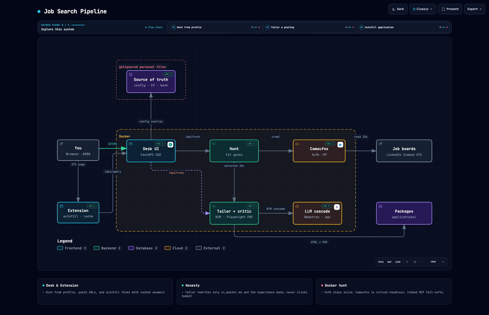
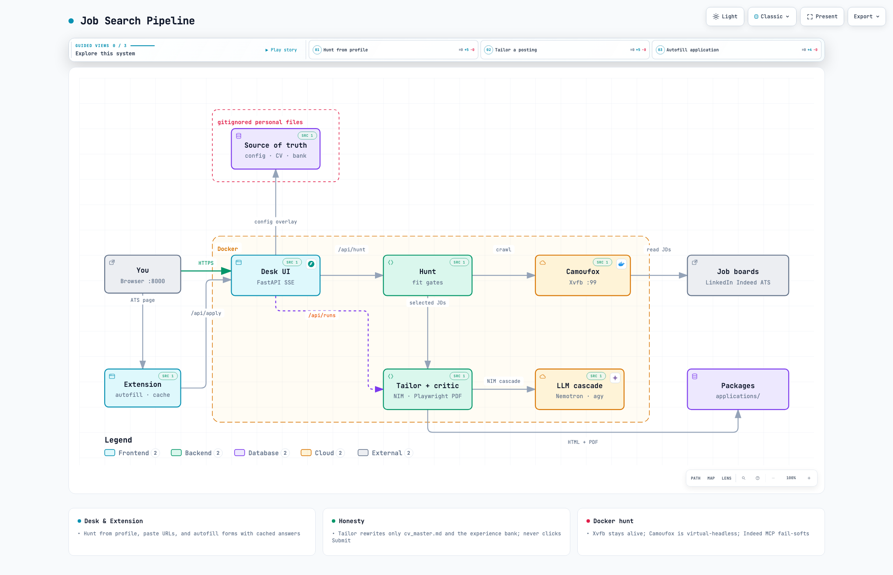
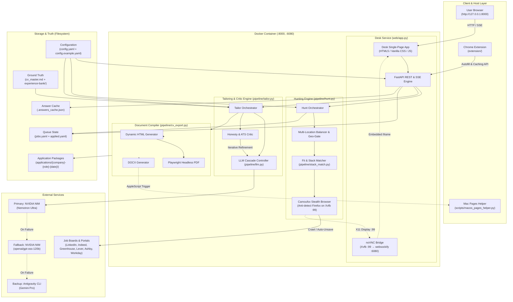

# Job Search Pipeline

Turns a job description into a tailored CV PDF, cover letter, LinkedIn DM, and a paste-by-field playbook. It only rewrites experience that is already in your master CV and experience bank. **It never clicks Submit.**

```
jobs.yaml / hunt / pasted URL  →  tailor (Nemotron, gpt-oss, then agy)  →  honesty critic  →  HTML → PDF
                                                                      ↓
                                         applications/<company>-<role>-<date>/
```

The desk, hunt, Camoufox, and tailor all run **inside Docker**. Do not start uvicorn on the host.

## Architecture

The Job Search Pipeline is an automated, containerized job discovery, tailoring, and application-prep platform. It operates strictly on a **human-in-the-loop** model: it automates discovery, stack evaluation, CV customization, ATS scoring, and form autofill, but **never clicks Submit**.

<p align="center">
  <a href="docs/architecture/job-search-runtime.png">
    
  </a>
  <br/>
  <em>🔍 <b>Click the diagram to view in full resolution (2048×1320) or right-click to save.</b></em>
</p>

<p align="center">
  <a href="docs/architecture/job-search-runtime.png"><b>Dark Theme (2048×1320 PNG)</b></a> ·
  <a href="docs/architecture/job-search-runtime-light.png"><b>Light Theme (2048×1320 PNG)</b></a> ·
  <a href="docs/architecture/job-search-runtime.html"><b>Interactive Runtime Map (HTML)</b></a> ·
  <a href="docs/architecture/job-search-runtime.architecture.json"><b>Typed Source (JSON)</b></a>
</p>

<details>
<summary><b>☀️ View Light Theme Architecture Diagram</b></summary>
<p align="center">
  <a href="docs/architecture/job-search-runtime-light.png">
    
  </a>
  <br/>
  <em>🔍 <b>Click the diagram to view in full resolution (2048×1320) or right-click to save.</b></em>
</p>
</details>

<details>
<summary><b>📐 View Mermaid Component Topology</b></summary>



</details>

### Core Subsystems

#### 1. Desk UI & Real-Time Orchestration Hub (`web/app.py`, `web/static/`)
- **FastAPI Engine (`web/app.py`)**: Runs inside Docker on port `8000`, serving both the REST API and the dashboard UI.
- **Server-Sent Events (SSE)**: Streams granular task progress live (`/api/runs/{run_id}/stream`), updating UI indicators for each active job (`Searching`, `Writing CV`, `Scoring ATS`, `Building PDF`, `Ready`, `Stopped`).
- **Interactive VNC Bridge**: `scripts/docker-entrypoint.sh` initializes Xvfb on display `:99`, paired with `x11vnc` and `websockify` on port `6080`. The Desk UI dynamically embeds a noVNC iframe *only* when a job board requires human intervention (CAPTCHA, 2FA, or interactive login).
- **Application Lifecycle Controls**: Handles manual URL & JD intake, job tailoring runs, PDF rebuilds, direct ATS form launching, and job management (separating active listings from applied listings, backed by a 5-second undo timer).

#### 2. Automated Hunting & Discovery Engine (`pipeline/hunt.py`, `pipeline/browser_hunt.py`, `pipeline/search.py`)
- **Multi-Source Aggregation**:
  - **LinkedIn**: Crawls search results and saved jobs. Automatically unsaves applied and deleted jobs via Camoufox to keep saved queues clean.
  - **Indeed**: Discovers postings via Camoufox browser automation or the optional Indeed MCP server.
  - **ATS Search Dorks**: Searches Google with targeted site queries across major ATS boards (Greenhouse, Lever, Ashby, Workday, iCIMS, Taleo, SmartRecruiters, and custom company boards).
  - **Public Job APIs**: Queries Remotive and The Muse with automatic schema normalization.
- **Multi-Location Query Balancing**: Rotates searches evenly across configured target markets and cities (e.g., Montreal, Toronto, Ottawa, and Remote Canada) to prevent geographic bias or search exhaustion.
- **Strict Geo-Fencing**: Strictly enforces target location boundaries, eliminating US-only job leakage while preserving Canada-eligible and remote postings.
- **Fit Gates & Stack Matching (`pipeline/stack_match.py`)**:
  - **Title Veto Tokens**: Instantly skips unwanted titles or seniority levels (e.g., intern, junior, director, QA).
  - **Stack Analysis**: Gating requires preferred skills to be present and strictly rejects roles requiring forbidden technologies (`hunt.reject_skills`).
  - **Experience Gating**: Skips jobs demanding years of experience beyond the user profile plus configured buffer.

#### 3. Camoufox Anti-Detect Browser Automation (`pipeline/browser_hunt.py`, `pipeline/apply_url.py`)
- **Stealth Headed Automation**: Uses Camoufox (anti-detect Firefox build) running inside the container's Xvfb virtual display `:99`. Camoufox prevents anti-bot fingerprinting without popping up native windows on the host.
- **Direct Form URL Resolution (`pipeline/apply_url.py`)**: Resolves indirect job board links (e.g., LinkedIn `/jobs/view/...` or Indeed `/viewjob?...`) into direct canonical ATS application portal URLs (Greenhouse, Lever, Workday, etc.).
- **Session Persistence**: Browser profiles, session cookies, and authentication tokens are persisted in the gitignored `.camoufox-profile/` directory.

#### 4. Tailoring & Honesty Critic Engine (`pipeline/tailor.py`, `pipeline/llm.py`)
- **LLM Cascade & Fault Tolerance**:
  1. **Primary**: NVIDIA NIM (`pipeline.model`, default `nvidia/nemotron-4-340b-instruct` / Nemotron Ultra).
  2. **Secondary Fallback**: NVIDIA NIM (`pipeline.nvidia.fallback_model`, default `openai/gpt-oss-120b`).
  3. **Tertiary Fallback**: Antigravity CLI / Gemini (`pipeline.fallback_model`, default `agy` with `gemini-3.1-pro`).
  - Automatically handles model outages, quota exhaustion, and provider failures while honoring rate limits (40 RPM default) and managing parallel worker pools (`pipeline.workers`).
- **Ground-Truth Invariant ("Honesty Critic")**:
  - The tailor is strictly constrained to `cv_master.md` and `experience-bank/*.md`. It is strictly forbidden from fabricating employers, employment dates, degrees, or unearned metrics.
  - **Key Skills Enrichment**: Enriches the Key Skills summary with matching JD keywords only when substantiated by existing master experience.
  - **Iterative Scoring Loop**: Calculates ATS match score and evaluates honesty. If either score falls below threshold (`pipeline.ats_threshold`), it loops with corrective feedback up to `pipeline.max_attempts`.

#### 5. Multi-Format Document Compiler (`pipeline/cv_export.py`, `resumes/template.html`)
- **Dynamic HTML Template**: Fills `resumes/template.html` with role-adapted content and dynamic bullet counts (`cv_format.bullets.dynamic`), allocating more bullets to directly relevant past employers. Unused bullet rows are cleanly omitted.
- **Playwright PDF Generation**: Compiles pixel-perfect PDFs via headless Chromium with strict CSS page-budget preservation (`cv_format.pages`).
- **Multi-Format Output**: Compiles Word (`.docx`) and native Apple Pages (`.pages`) formats. Native Pages export is orchestrated via `scripts/macos_pages_helper.py` running on the host Mac.
- **Complete Application Dossiers**: Each tailored role receives a dedicated folder under `applications/<company>-<role>-<date>/` containing:
  - `<Name>_CV.pdf`, `<Name>_CV.html`, `<Name>_CV.docx`, `<Name>_CV.pages`
  - `cover_letter.md` (250–400 word targeted cover letter)
  - `linkedin_dm.txt` (≤60-word cold outreach message)
  - `why_i_fit.txt` (3-bullet fit summary)
  - `playbook.md` (Q&A cheat sheet for ATS forms)
  - `analysis.md` & `llm_output_raw.txt` (scoring and generation audit logs)

#### 6. Chrome Extension & Form Autofill Assistant (`extension/`, `pipeline/fill.py`)
- **Manifest V3 Browser Extension (`extension/`)**:
  - Interacts with Desk API endpoints (`/api/apply/for-page`, `/api/packages/{package_id}/fill`, `/api/apply/answer`).
  - Injects into ATS job applications (Greenhouse, Lever, Ashby, Workday, etc.) to autofill personal information, work authorizations, and playbook Q&As.
  - Auto-attaches the compiled tailored CV PDF directly into the application file-upload input.
- **Question-Answer Caching**: Custom application questions answered by the user or generated via LLM are cached in `.answers_cache.json` and reused across future applications.
- **Visual Question Tracking**: Highlights processed form fields and flags ambiguous or unhandled custom questions for manual review.

#### 7. State, Queue & Memory Architecture
- **Configuration Hierarchy**: Deep-merges tracked defaults (`config.example.yaml`) with user-specific gitignored overrides (`config.yaml`).
- **Queue Segregation**:
  - `jobs.yaml`: Active queue of discovered and in-progress job postings.
  - `applied.yaml`: Completed/submitted postings archive, preventing search pollution and re-crawling.
  - `applications/_tracker.md`: High-level markdown audit table linking tailored applications, ATS scores, and application links.
- **Feedback & Experience Bank (`memory/`, `experience-bank/`)**:
  - `memory/feedback.md`: Negative prompt guidelines and writing corrections loaded into the tailor on every run to prevent repeat style errors.
  - `experience-bank/*.md`: Deep repository of employer-specific bullet variations and project narratives.

### Key Architectural Invariants

| Principle | Enforcement Mechanism |
|---|---|
| **Never Clicks Submit** | Form autofill and browser automation strictly halt before submission. Final review and submission are exclusively performed by the human user. |
| **No Hallucinated Experience** | Tailoring prompt and honesty critic reject any bullet points, skills, or metrics not grounded in `cv_master.md` or `experience-bank/`. |
| **Containerized Sandboxing** | All browser crawling, LLM communication, and desk server operations run inside Docker with mounted credentials and persistent browser profiles. |
| **Rate-Limited Resiliency** | Centralized semaphore and token rate-limiter prevents 429 throttling across parallel tailoring workers. |

Runtime map (Archify, pinned to commit `a4c61fe`): open [`docs/architecture/job-search-runtime.html`](docs/architecture/job-search-runtime.html) in a browser. Typed source is [`docs/architecture/job-search-runtime.architecture.json`](docs/architecture/job-search-runtime.architecture.json).

## Prerequisites

- Docker + Docker Compose
- An LLM key in `.env` (copy from `.env.example`):
  - **`NVIDIA_API_KEY`** — primary. Create one at [build.nvidia.com](https://build.nvidia.com/) (NIM, `https://integrate.api.nvidia.com/v1`). Tailor tries Nemotron Ultra, then `openai/gpt-oss-120b`, then agy.
  - **`GEMINI_API_KEY`** or `agy auth login` — last backup. The image already includes the agy CLI; Compose mounts `~/.gemini` if you logged in on the host.
- Optional on macOS: Pages.app, if you want native `.pages` files (Word still works without it)

## How configuration is loaded

1. `config.example.yaml` is the full default schema. It is tracked in git.
2. `config.yaml` is **your** overlay. It is gitignored. Copy the example and edit it.
3. The pipeline **deep-merges** example + overlay. A key you set in `config.yaml` wins. A **list** you set replaces the example list (it is not appended). Never write `ats_boards: []` and then list items under it — that is invalid YAML and Hunt will fail.
4. Paths such as `cv_master.md` are resolved from `JOB_SEARCH_ROOT` (Docker sets `/app`) or the repo directory. `workspace.root` is for Cursor skills, not for Python inside Docker.

Never commit `config.yaml`. It may contain your LinkedIn password.

## First-time setup

```bash
git clone https://github.com/Vamshi1207/job_hunter.git
cd job_hunter

cp config.example.yaml config.yaml
cp jobs.example.yaml jobs.yaml
cp cv_master.example.md cv_master.md
cp resumes/template.example.html resumes/template.html
cp memory/project.template.md memory/project.md
cp memory/feedback.template.md memory/feedback.md
cp experience-bank/example-project.md experience-bank/YOUR-EMPLOYER.md
cp experience-bank/about-variants.example.md experience-bank/about-variants.md
cp .env.example .env
mkdir -p .cursor && cp .cursor/mcp.example.json .cursor/mcp.json   # optional Indeed MCP in Cursor
```

Then edit the copies. Put your NVIDIA (and optional Gemini) keys in `.env`. Minimum to get a PDF: `config.yaml` (name + `experience.jobs`), `cv_master.md`, `resumes/template.html`, and at least one LLM key. Hunt also needs `career.target_roles`, `career.target_markets`, and LinkedIn login if you hunt LinkedIn. `applications/_tracker.md` is created automatically after the first successful tailor.

### Personal files (gitignored) and their examples

| You create / edit (gitignored) | Copy from (tracked) | Required? | What to configure |
|---|---|---|---|
| `config.yaml` | `config.example.yaml` | **Yes** | Identity, visa, CV layout, hunt filters, LinkedIn login. See [config.yaml keys](#configyaml-what-to-set) below. |
| `cv_master.md` | `cv_master.example.md` | **Yes** | Canonical resume. The tailor may rephrase this; it must not invent jobs or metrics. Keep employer names aligned with `experience.jobs` and the HTML template. |
| `resumes/template.html` | `resumes/template.example.html` | **Yes** | HTML layout and `{{JOB1_*}}` placeholders. Company names in the HTML are static; titles/bullets are filled per job. |
| `jobs.yaml` | `jobs.example.yaml` | For CLI | Active queue. Hunt/desk append here when you tailor. Applied postings are moved to `applied.yaml`. |
| `applied.yaml` | `applied.example.yaml` | Auto | Jobs you marked applied. Separate from the queue so hunt does not treat them as still open. |
| `memory/project.md` | `memory/project.template.md` | Recommended | Profile narrative, visa wording, positioning. Loaded into the tailor prompt. Keep in sync with `config.yaml` `user` / `visa` / `career`. |
| `memory/feedback.md` | `memory/feedback.template.md` | Recommended | Writing rules. Add a rule whenever you correct a draft so the next tailor does not repeat it. |
| `experience-bank/*.md` | `experience-bank/example-project.md`, `about-variants.example.md` | Recommended | Alternate bullets per employer/project. Filenames with `example` are skipped by the tailor. |
| `applications/_tracker.md` | (created at runtime) | Optional | Status table. Written automatically after a successful tailor. |
| `.env` | `.env.example` | **Yes for NVIDIA / Gemini** | `NVIDIA_API_KEY` and optional `GEMINI_API_KEY`. Compose reads this file and injects the keys into the container. |
| `.cursor/mcp.json` | `.cursor/mcp.example.json` | Optional | Indeed MCP URL for Cursor. OAuth is in Cursor Settings → MCP. Desk hunt continues with Camoufox if OAuth is missing. |
| `.camoufox-profile/` | (created at runtime) | Auto | Browser cookies. Gitignored. Re-login if you delete it. |

`applications/<company>-<role>-<date>/` is also gitignored. That is output, not input.

## config.yaml: what to set

Open `config.example.yaml` for every key and comment. Below is what people actually change, and **where** it lives.

### Identity and work rights — `user`, `visa`, `outreach`

| Key | Where | Why |
|---|---|---|
| `user.full_name` / `preferred_name` | PDF filename, header, letters | Must match how you apply. |
| `user.email`, `phone`, `city`, `country` | Contact line, playbook | Phone format follows `cv_format.phone_format`. |
| `user.linkedin`, `user.github` | Contact links | `cv_format.contact_links`: `labels` vs full URLs. |
| `visa.status`, `visa.description` | Cover letter, playbook | Be honest. Forms will ask. |
| `visa.may_need_future_sponsorship` | Playbook | Sponsorship questions. |
| `outreach.signoff` | LinkedIn DM | e.g. `— Jane`. |

### Career and hunt targeting — `career`, `hunt`

| Key | Where | Why |
|---|---|---|
| `career.stage` | Tone | `junior` \| `mid` \| `senior` \| `career-changer` \| `academic`. |
| `career.years_experience` | Hunt fit gate | Skip JDs that require more than this plus `hunt.years_buffer` (default 2). |
| `career.target_markets` | Hunt location | Country/market to search, e.g. `Canada`. City is not pinned. |
| `hunt.search_locations` | Board search | Default: markets + United States. US jobs are kept only if open to Canada applicants. |
| `hunt.preferred_city` / `user.city` | Ranking | Preferred city (Montreal) ranks higher; it is not a search filter. |
| `career.target_roles` | Hunt queries (fallback) + title boost | Used in search keywords if `hunt.browser.queries` is empty. Titles do not have to match exactly; the JD stack decides keep/drop. |
| `hunt.max_jobs` | Desk “Hunt from profile” | `0` = tailor every match. A positive number is a safety ceiling, not a “best N” rank. |
| `hunt.exclude_levels` | Title veto | e.g. intern, junior, principal. `staff` still skips Staff Engineer; “Member of Technical Staff” / MTS is kept. |
| `hunt.exclude_title_tokens` | Title veto | e.g. manager, director, QA. |
| `hunt.browser.queries` | Board keywords | Skill-first searches (e.g. `python`) so odd titles still appear. Empty = first preferred skill + first target role. |
| `hunt.preferred_skills` | JD keep | After the posting text loads, at least one of these must appear. Languages here are the strong stack: C++-only roles are dropped for a Python profile; TypeScript/Go can still match. Unclear cases ask the LLM. |
| `hunt.reject_skills` | JD filter | Drop roles that require a skill you will not use (example: `java`). |
| `hunt.exclude_companies` | Search **and** saved jobs | Current/former employers you will not apply to. Add brand aliases if a board uses a shorter name. |
| `hunt.saved_jobs` | LinkedIn/Indeed saved | Treated as matches (fit gates skipped) unless the company is excluded. Camoufox clicks **Next** through saved-jobs pages until `max` or the last page. |
| `hunt.sources` / `hunt.ats_boards` | Camoufox | LinkedIn, Indeed, Google ATS dorks (Greenhouse, Lever, Ashby, Workday, iCIMS, Taleo, …), optional company board URLs. Hunt skips salary guides and search SERPs. |
| `hunt.api_sources` | Extra listings | `true` (default) adds The Muse and Remotive. No API key. Fit gates still apply. |
| `hunt.mcp.indeed` | Optional MCP | Same URL as `.cursor/mcp.example.json`. |
| `hunt.browser.logins.linkedin` | Auto-fill LinkedIn | **Password only in gitignored `config.yaml`.** Empty password = sign in by hand in the Camoufox panel. Cookies persist in `.camoufox-profile/`. |

### CV layout — `cv_format`, `experience`

| Key | Where | Why |
|---|---|---|
| `cv_format.pages` | PDF length | Source of truth. Type is not shrunk to fit (except a 1-page target that overflows). |
| `cv_format.page_size` | PDF | `letter` or `a4`. |
| `cv_format.density` | Type, leading, margins | `compact` or `comfortable`. |
| `cv_format.header_align` / `body_align` | Layout | `left`/`center` and `left`/`justify`. |
| `cv_format.keep_together` | Pagination | `skills`, `education` must not split. |
| `cv_format.section_order` | Body order | `summary`, `experience`, `skills`, `education`, `projects`. |
| `cv_format.bullets.max_lines` | Tailor prompt | Keep each bullet this short. |
| `cv_format.bullets.dynamic` | Tailor + HTML | `true` = per-JD counts within `min`/`max`. Stronger-matching employers get more bullets; unused `{{PREFIX_Bn}}` rows are dropped. |
| `cv_format.bullets.min` / `max` | Tailor + HTML | Range when `dynamic` is true. HTML is padded up to `max`. |
| `cv_format.color` / `type` | HTML CSS tokens | Fonts and ink. |
| `experience.jobs` | HTML slots | `prefix` must match `{{JOB1_TITLE}}` etc. in `resumes/template.html`. When `dynamic` is false, `bullets` is the exact count filled. When true, `bullets` is optional (raises the max if higher); use `bullets_min` / `bullets_max` to override per job. `employer` is the real company name. |

If you add a fourth job, add a `JOB4` block in **both** `config.yaml` and `resumes/template.html`.

### Pipeline runtime — `pipeline`

| Key | Why |
|---|---|
| `pipeline.provider` | `nvidia` (NIM API) or `agy` (Gemini CLI). |
| `pipeline.model` | Primary NIM model (default Nemotron Ultra). |
| `pipeline.nvidia.fallback_model` | Second NIM model if Nemotron fails (default `openai/gpt-oss-120b`). |
| `pipeline.fallback_provider` / `fallback_model` | Last resort after both NIM models (default `agy` / `gemini-3.1-pro`). |
| `pipeline.workers` | Parallel tailor jobs (default 4). Shared 40 req/min NVIDIA cap. |
| `pipeline.nvidia.rpm` | NVIDIA rate limit (default 40). |
| `pipeline.ats_threshold` | Stop when score **and** honesty meet this (default 80). |
| `pipeline.max_attempts` | Tailor/critic loops (default 3). |
| `pipeline.auto_apply` | Leave `false`. `--fill-form` still never clicks Submit. |

## Desk UI (Docker)

From the repo root (Compose loads `.env` automatically):

```bash
docker compose up ui --build
```

Open [http://127.0.0.1:8000](http://127.0.0.1:8000).

1. **Add postings by URL** is at the top of the desk. Paste one or more job links (one per line). Paste the **job description** to tailor from that text (used with a single URL).
2. Click **Hunt from profile**. Camoufox runs in the container. Each posting is tailored as soon as it matches; search keeps adding more. **Stop** cancels search and skips jobs not yet started. LinkedIn may need a one-time sign-in in that session (cookies live in `.camoufox-profile/`). Apply/Submit is never clicked.
3. Status on each row is the current step (searching, Writing CV, Scoring ATS, Building PDF, Ready, Stopped, …), not a generic “working”. Already tailored **job URLs** are skipped. Two postings at the same company with the same title but different URLs are both tailored. If LinkedIn asks for sign-in or extra verification, the **Camoufox** panel opens — click and type there. Hunt waits until you finish (default 5 minutes).
4. The table groups **Ready to apply** and **Applied**. Search by job, company, or location. Click a column header to sort A–Z or Z–A. **Apply** opens the company form when hunt could resolve it from LinkedIn/Indeed; the form URL sits under the button. **Mark applied** after you submit. Install the Chrome extension from `extension/` once; on the form page click the toolbar icon to fill fields and upload that job's CV. **Delete** removes that `applications/<folder>/`. Click a row for score, cover letter, and playbook.

Python pipeline changes need a container restart (`docker compose up -d ui` or `--build` after `requirements.txt` / Dockerfile changes). HTML/CSS/JS update from the bind mount without a rebuild.

Native `.pages` files are written by Pages.app on the Mac. From another terminal:

```bash
python3 scripts/macos_pages_helper.py
```

That converts existing Word CVs and keeps listening so Docker hunts can save real Pages files. Word still opens in Pages if the helper is not running.

### How hunt runs in Docker

Firefox draws on a virtual display inside the container. The desk **Camoufox** panel (noVNC) is that display, and it appears only when a board asks you to sign in, complete 2FA, or solve a CAPTCHA. There is no separate Mac Firefox window.

| Piece | Role |
|---|---|
| `scripts/docker-entrypoint.sh` | Starts Xvfb on `DISPLAY=:99` with `setsid` so it survives `exec` into uvicorn. Then x11vnc + websockify so the desk can show it. |
| Headed Camoufox on `:99` | Same display as noVNC. Do not use Camoufox `headless: "virtual"` — that starts a private Xvfb the panel cannot see. |
| `127.0.0.1:6080` | noVNC. Bound to localhost only. Opened as an iframe on the desk only when you need to act. |
| `security_opt: seccomp:unconfined` + `cap_add: SYS_ADMIN` | Firefox 138+ needs `unshare` for its sandbox. Docker’s default seccomp blocks it (`CanCreateUserNamespace() clone() failure: EPERM`). |
| `MOZ_DISABLE_CONTENT_SANDBOX=1` | Extra sandbox bypass for the same EPERM. |
| `.camoufox-profile/` | Persistent cookies (gitignored). Re-login if you delete it. |

Compose also sets `shm_size: 2gb` (browsers crash in the default 64MB `/dev/shm`).

### Hunt troubleshooting

| Live strip / log | What it means |
|---|---|
| `cannot open display: :99` | Xvfb died or `DISPLAY` was unset. Rebuild: `docker compose up ui --build`. |
| `Invalid YAML in config.example.yaml` | Broken example or overlay (often `key: []` plus list items). Fix the YAML, then Hunt again. |
| `CanCreateUserNamespace() clone() failure: EPERM` | Seccomp blocked Firefox. Confirm `docker-compose.yml` still has `seccomp:unconfined`. |
| `Indeed MCP skipped` | Optional. Install the `mcp` package and complete Cursor OAuth, or ignore — hunt continues with Camoufox. |
| `Hunt found no matching postings` | Camoufox started but fit filters / login / sources yielded nothing. Check LinkedIn login in `.camoufox-profile`, `hunt.exclude_*`, and `career.target_roles`. Salary/career-explorer URLs are skipped on purpose. |

## CLI (Docker)

```bash
docker compose run --rm pipeline python3 -m pipeline.run_pipeline --hunt
docker compose run --rm pipeline python3 -m pipeline.run_pipeline --job ExampleCorp
```

A run calls the LLM (can take a few minutes). Edit `jobs.yaml` first for `--job`.

## Output

```
applications/<company>-<role>-<YYYY-MM-DD>/
├── <Your_Name>_CV.pdf      ← upload this
├── <Your_Name>_CV.html     ← editable
├── <Your_Name>_CV.docx     ← Word
├── <Your_Name>_CV.pages    ← Pages (native; needs Pages.app on the Mac)
├── <Your_Name>_CV_changes.md
├── cover_letter.md
├── linkedin_dm.txt
├── why_i_fit.txt
├── analysis.md
├── playbook.md             ← paste into the ATS; you click Submit
└── llm_output_raw.txt
```

## Tests (no LLM)

From the host (Python 3.10+):

```bash
python3 -m unittest discover -p 'test_*.py'
```

Or inside Docker:

```bash
docker compose run --rm --profile batch pipeline python3 -m unittest discover -p 'test_*.py'
```

## Cursor skills

Skills `job-hunt` and `cv-tailor` use the same `config.yaml`, master CV, bank, and `applications/` folders. Use the pipeline for PDFs; use the skills in chat to review drafts, research companies, and walk through submission. Indeed MCP: copy `.cursor/mcp.example.json` and complete OAuth in Cursor Settings → MCP.

## Changelog (this branch)

What landed since the last published `main`:

- **More ATS via Google**: Greenhouse, Lever, Ashby, Workday, iCIMS, Taleo, and others; two search queries; grouped `site:` dorks. Muse/Remotive APIs on by default.
- **Camoufox panel**: appears only for sign-in, 2FA, or CAPTCHA (noVNC at localhost:6080). Hunt waits until you finish, then the panel hides.
- **Streamed hunt**: tailor starts as soon as a posting matches; search keeps adding jobs. **Stop** cancels the rest.
- **Live step status**: Writing CV, Scoring ATS, Building PDF, Searching LinkedIn, Stopped — not a generic Working label.
- **LLM chain**: NVIDIA Nemotron → `openai/gpt-oss-120b` → agy/Gemini. Put `NVIDIA_API_KEY` in `.env`.
- **URL form** at the top of the desk; **Rebuild PDF** after HTML edits; native Pages via `scripts/macos_pages_helper.py`.
- **Fit gates, not ranking**: `hunt.max_jobs: 0` tailors every match. JD stack decides keep/drop; titles are vetoes only.
- **Live hunt table**, Word/HTML/Pages downloads, skip salary/search pages, skip already processed job URLs (same title at one company with a new URL is kept).
- **Docker-only desk** at port 8000. Camoufox needs the entrypoint Xvfb and seccomp flags in `docker-compose.yml`.
- **Gitignored personal files** have tracked examples (`config.example.yaml`, `cv_master.example.md`, `jobs.example.yaml`, `resumes/template.example.html`, memory templates, experience-bank examples, `.env.example`, `.cursor/mcp.example.json`). Copy them once; never commit `config.yaml` (it may hold a LinkedIn password). `applications/_tracker.md` is created at runtime.
